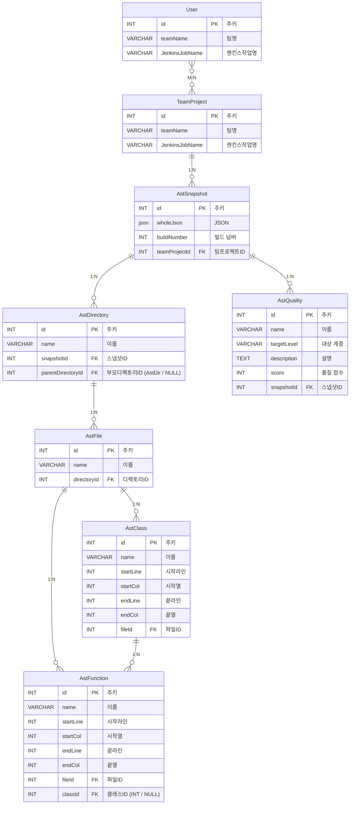

# ERD — Entity Relationship Diagram

> 백엔드 NestJS DB 엔티티 관계도 (참조용)
> 프론트엔드에서 API 응답 데이터 구조 이해를 위해 기록

---

## 엔티티 관계도



---

## 프론트엔드 관점의 핵심 엔티티

### 시각화에 사용되는 데이터 흐름
```
AstSnapshot (buildNumber 선택)
    └── AstDirectory (트리 루트, parentDirectoryId = NULL)
            └── AstDirectory (중첩 디렉토리)
                    └── AstFile
                            ├── AstClass
                            │       └── AstFunction (classId = 해당 클래스)
                            └── AstFunction (classId = NULL, 파일 직속 함수)
```

---

## React Flow 노드 매핑

| DB 엔티티 | Flow 노드 타입 | 표시 데이터 |
|---|---|---|
| AstDirectory | `directory` | `name`, 하위 자식 수 |
| AstFile | `file` | `name` |
| AstClass | `class` | `name`, `startLine`, `endLine` |
| AstFunction | `function` | `name`, `startLine`, `endLine`, `classId` |

---

## AstQuality 활용

| 필드 | 시각화 활용 방안 |
|---|---|
| `targetLevel` | 파일/클래스/함수 레벨 품질 표시 |
| `score` | 노드 색상 코딩 (Good/Warning/Bad) |
| `description` | 툴팁 또는 사이드패널 표시 |

---

## ⚠️ 실제 API 응답 구조 분석 (snapshotId=55 기준)

### 핵심 발견 사항
1. **`directories`는 플랫(flat) 배열** — 트리 구조가 아닌 모든 디렉토리를 flat하게 반환 → `parentDirectoryId`로 트리 재구성 필요
2. **`childDirectories`** — 직계 자식 디렉토리 목록 (id 등 포함, files/classes 없음)
3. **파일 내 함수는 `fileFunctions`** — `functions`가 아닌 `fileFunctions` 키 사용
4. **클래스 내 메서드는 `methods`** — `functions`가 아닌 `methods` 키 사용
5. **`name: "class"` 엔트리** — Tree-sitter 파싱 아티팩트, 필터링 필요 (`startCol==endCol==5` 패턴)
6. **메서드의 `fileId`는 `null`** — classId만 존재
7. **`parentFunctionId` 필드 존재** — 중첩 함수 지원

## 프론트엔드 TypeScript 인터페이스 (실제 확인)

```typescript
// interface/ast.interface.ts

/** 클래스 메서드 또는 파일-레벨 함수 */
export interface AstFunction {
  id: number;
  createdAt: string;
  updatedAt: string;
  name: string;
  startLine: number;
  startCol: number;
  endLine: number;
  endCol: number;
  fileId: number | null;       // 메서드인 경우 null
  classId: number | null;      // 파일-레벨 함수인 경우 null
  parentFunctionId: number | null;
  childFunctions?: AstFunction[];
}

/** 파일 내 클래스 (name==='class' 인 아티팩트 엔트리 제외 필요) */
export interface AstClass {
  id: number;
  createdAt: string;
  updatedAt: string;
  name: string;
  fileId: number;
  startLine: number;
  startCol: number;
  endLine: number;
  endCol: number;
  methods: AstFunction[];      // 클래스 내 메서드 (fileFunctions 아님)
  parentClassId: number | null;
  parentFunctionId: number | null;
}

/** 디렉토리 내 파일 */
export interface AstFile {
  id: number;
  createdAt: string;
  updatedAt: string;
  name: string;
  directoryId: number;
  classes: AstClass[];         // name==='class' 아티팩트 필터링 필요
  fileFunctions: AstFunction[]; // ⚠️ 'functions'가 아닌 'fileFunctions'
}

/** 디렉토리 (flat 배열로 반환됨 — parentDirectoryId로 트리 재구성 필요) */
export interface AstDirectory {
  id: number;
  createdAt: string;
  updatedAt: string;
  name: string;
  snapshotId: number;
  parentDirectoryId: number | null;
  childDirectories: Pick<AstDirectory, 'id' | 'name' | 'snapshotId' | 'parentDirectoryId'>[]; // 축약형
  files: AstFile[];
}

/** 스냅샷 최상위 */
export interface AstSnapshot {
  id: number;
  createdAt: string;
  updatedAt: string;
  teamProjectId: number;
  directories: AstDirectory[]; // 플랫 배열
}

/** React Flow 변환 시 사용할 실제 트리 노드 */
export interface AstTreeDirectory extends AstDirectory {
  children: AstTreeDirectory[];
}
```

### 필터링 로직 (astToFlow.ts 에서 적용)
```typescript
// Tree-sitter 아티팩트 클래스 필터:
// name === 'class' && methods.length === 0 인 엔트리는 렌더링 제외
const realClasses = file.classes.filter(c => c.name !== 'class');
```
